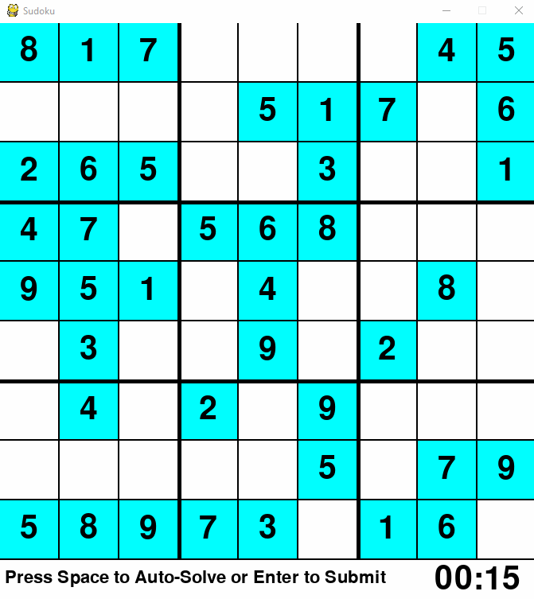

# sudoku
<h2>Sudoku</h2>
Sudoku puzzle game created using PyGame.
Includes a auto-solver that can be executed by pressing space, which implements a recurisive backtracking algorithm.

<h3>Preview Below:</h3>

